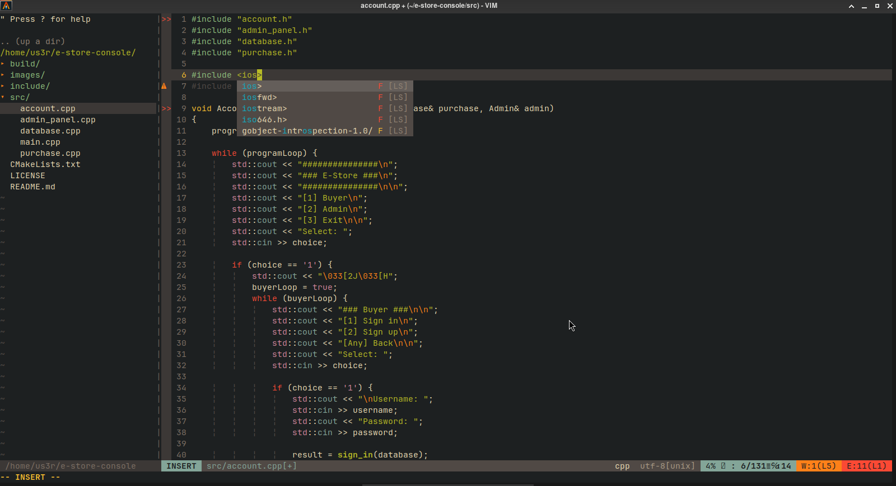

# Vim Config for C++ Development

## Features
- Plugin manager: vim-plug  
- Autocomplete: coc.nvim + coc-clangd  
- Autoformat on save: vim-autoformat  
- Language support: vim-polyglot  
- File explorer: NERDTree  
- Status bar: vim-airline  
- Themes: gruvbox (default), ayu-vim  
- Indentation guides: indentLine  
- Auto-pairs for brackets

## Settings
- Syntax highlighting and autocomplete  
- Indents: 4 spaces, smartindent, autoindent  
- Autoformat on save  
- Keymaps for windows and NERDTree (F2, Ctrl-n, Ctrl-h/j/k/l)  
- Auto-open NERDTree on start  
- Compile & run C++ (F5, via cmake)  
- Mouse and clipboard support (Ctrl-c/v)

## Usage
1. Copy .vimrc to home folder  
2. Run :PlugInstall in Vim  
3. Work on C++ projects with cmake  
4. Use F5 to compile and run

---

** Not a tutorial project **

---

_Example screenshot:_

---

# Vim конфиг для C++ разработки

## Возможности
- Менеджер плагинов: vim-plug  
- Автодополнение: coc.nvim + coc-clangd  
- Автоформат при сохранении: vim-autoformat  
- Поддержка языков: vim-polyglot  
- Файловый менеджер: NERDTree  
- Статус-бар: vim-airline  
- Темы: gruvbox (по умолчанию), ayu-vim  
- Отступы: indentLine  
- Автозакрытие скобок

## Настройки
- Подсветка и автодополнение  
- Отступы: 4 пробела, smartindent, autoindent  
- Автоформат при сохранении  
- Горячие клавиши (F2, Ctrl-n, Ctrl-h/j/k/l)  
- Автооткрытие NERDTree  
- Компиляция и запуск C++ (F5 через cmake)  
- Мышь и буфер обмена (Ctrl-c/v)

## Использование
1. Скопировать .vimrc в домашнюю папку  
2. В Vim выполнить :PlugInstall  
3. Работать с C++ проектами через cmake  
4. F5 — компиляция и запуск

---

**Это не учебный проект **
